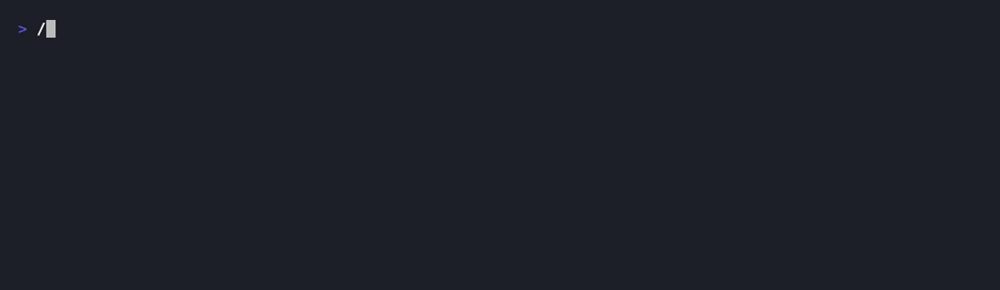

# portview

[](https://github.com/jeramiahgcoffey/portview/actions/workflows/ci.yaml)
[](https://pkg.go.dev/github.com/jeramiahgcoffey/portview)
[](LICENSE)

A lightweight terminal UI for discovering and managing the dev servers listening
on your machine. It auto-discovers TCP servers on localhost, shows the process
that owns each port, and lets you open, inspect, kill, label, and filter them.
Docker-published ports resolve to their container, and every action is also
available as a plain CLI subcommand for scripting.

No more `lsof -i -P | grep LISTEN` or trying to remember which port your frontend
is on.



```text
╭─ portview ──────────────────────────────────────────╮
│  PORT   PROCESS       COMMAND            LABEL      │
│ ► 3000  node          next dev           frontend   │
│   3001  node          express server.js  api        │
│   5432  postgres      postgres -D ...               │
│   8080  go            go run main.go     backend    │
├─────────────────────────────────────────────────────┤
│  4 servers · refreshed 1s ago                       │
│  o:open  x:kill  l:label  r:refresh  /:filter  ?:help│
╰─────────────────────────────────────────────────────╯
```

## Install

### go install

```sh
go install github.com/jeramiahgcoffey/portview/cmd/portview@latest
```

### Homebrew

```sh
brew install jeramiahgcoffey/tap/portview
```

### Pre-built binaries

Download from the [releases page](https://github.com/jeramiahgcoffey/portview/releases).

## Usage

Run it:

```sh
portview
```

portview polls every few seconds and keeps the list current. Healthy ports
(those that accept a TCP connection) are shown in green; unresponsive ones in
yellow.

### Keybindings

| Key            | Action                                    |
| -------------- | ----------------------------------------- |
| `↑`/`↓`, `j`/`k` | Navigate the list                       |
| `o`, `Enter`   | Open `localhost:<port>` in your browser   |
| `i`            | Inspect the selected server (insight pane) |
| `x`            | Kill the process (with y/n confirmation)  |
| `l`            | Set or edit the label for the port        |
| `r`            | Force an immediate refresh                |
| `/`            | Filter by port, process, label, or container |
| `?`            | Toggle the help overlay                   |
| `q`, `Ctrl+C`  | Quit                                      |

> The design doc binds `k` to both navigation and kill; portview uses `x` for
> kill so `j`/`k` remain vim-style navigation.

### Insight pane

Press `i` on any server to see what it actually is:

- **cwd** — the working directory of the process, i.e. which project owns the port
- **uptime**, **cpu/mem**, and resident memory
- **http** — a one-shot HTTP probe: status code, latency, and `Server` header
  (probes run only on demand, never during the background poll)

Inside the pane: `r` re-inspects, `o` opens the browser, `esc`/`i` goes back.

### Docker containers

Ports published by a container normally show up as an opaque proxy process
(`com.docker.backend` on macOS, `docker-proxy` on Linux, `OrbStack Helper`
with OrbStack). portview resolves them to the real container:

- The list shows the **container name** and image instead of the proxy.
- `x` runs `docker stop <container>` instead of signaling the proxy process —
  SIGTERM on Docker's proxy would take down the whole daemon, not the container.
- `/` filtering matches container names and images.

Requires a working `docker` CLI; if it's missing, ports simply display as the
proxy process.

## CLI mode

Every action works without the TUI, for scripts and aliases:

```sh
portview list            # table of listening servers
portview list --json     # same, as JSON (labels, health, containers included)
portview list --all      # include ports hidden by config
portview kill 3000       # SIGTERM the process on :3000 (docker stop for containers)
portview open 3000       # open localhost:3000 in the browser
```

`kill` exits non-zero when the port has no listener, so it composes with
`&&`/`||` in scripts.

## Configuration

portview works with zero configuration. To customize, create
`~/.config/portview/config.yaml` (respects `$XDG_CONFIG_HOME`). The file is also
created automatically the first time you set a label or hide a port.

```yaml
refresh_interval: 3s
port_range:
  min: 1024
  max: 65535

labels:
  3000: frontend
  3001: api
  8080: backend

hidden:
  - 5432
  - 6379
```

- **labels** — persistent, port-based names shown in the LABEL column.
- **hidden** — ports filtered out of the display (useful for noisy background
  services).
- **port_range** — only ports in this inclusive range are scanned. Ports below
  1024 are skipped by default to avoid system-service noise.
- **refresh_interval** — how often the list re-scans.

## Platform support

| Platform | Backend                                  |
| -------- | ---------------------------------------- |
| macOS    | `lsof` + `ps`                            |
| Linux    | `/proc/net/tcp` + `/proc/{pid}` lookups  |

Windows is not supported yet. Without elevated privileges, ports owned by
other users may appear without process details (same as unprivileged `lsof`).

Docker containers are discovered through the `docker` CLI, so container names
and images appear on both macOS (Docker Desktop / OrbStack) and Linux.

## Contributing

See [CONTRIBUTING.md](CONTRIBUTING.md). Issues and PRs welcome.

## License

[MIT](LICENSE)
